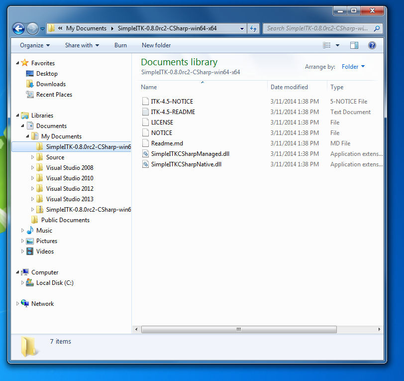
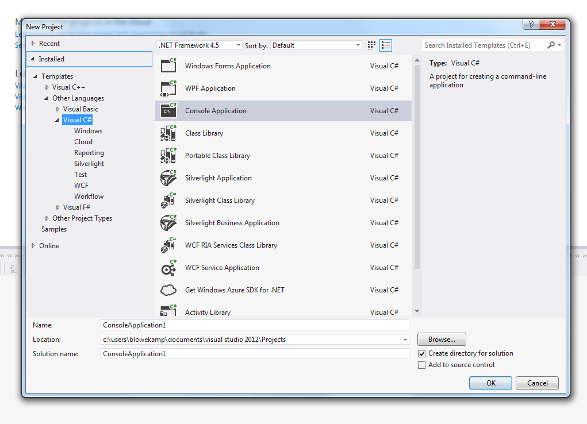
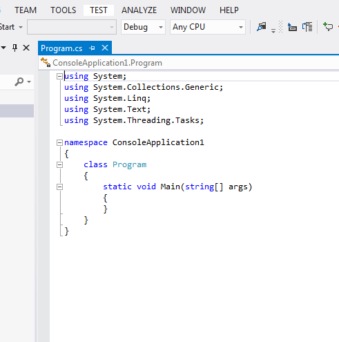
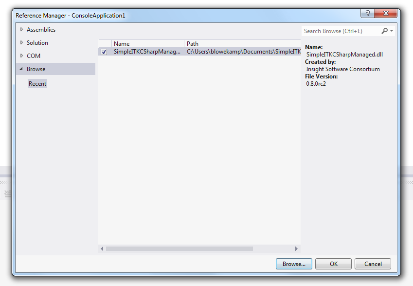
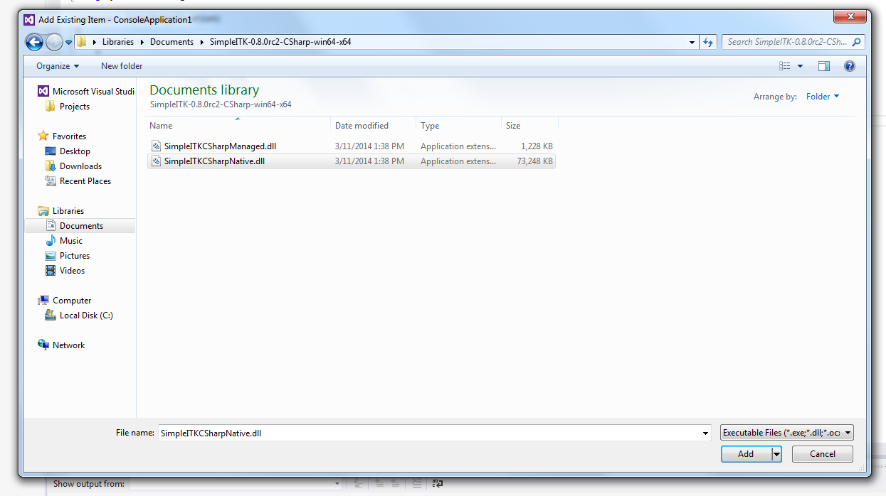
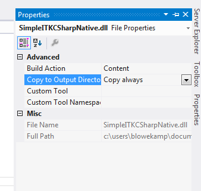
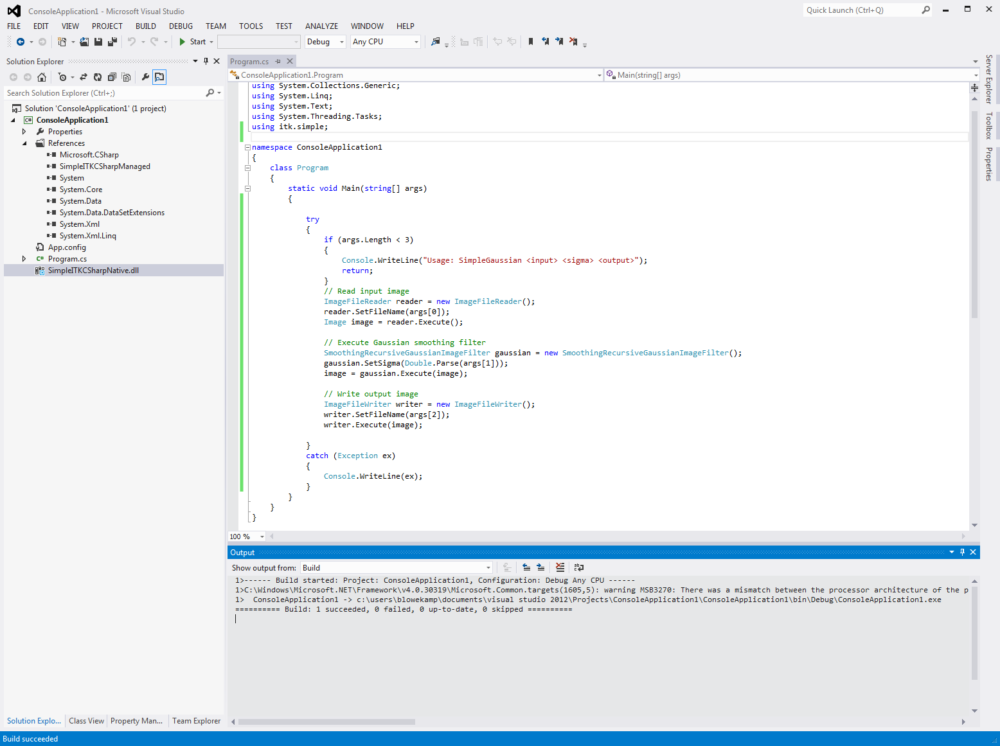

Visual guide to SimpleITK with CSharp
*************************************

In this guide we will show how to setup a C# project in Microsoft Visual Studio 2012 which uses the available built binaries for SimpleITK. The same steps and options are needed for the other versions of Visual Studio.

.. contents:: On this page
    :local:
    :backlinks: none

Download
========

Binary downloads are readily available for C# for Microsoft Visual Studio. They are available on `SourceForge <https://sourceforge.net/projects/simpleitk/files/SimpleITK/>`_.

Download the correct binary for you architecture you are going to target.
	C# for SimpleITK has two components: Native and Managed. The native code contains the SimpleITK C++ library and is compiled for the particular architecture. There is the "win32" for the Intel x86 32-bit architecture, and the "win64" for the Intel x64 architecture. The correct architecture needs to be chosen.
Unzip the downloaded zip file into your "Documents" folder.
	Inside you will find two "dll" files: "SimpleITKCSharpManaged.dll" and "SimpleITKCSharpNative.dll", as well as some documentation files.

     
    Download an unzip the CSharp distribution.

Adding C# SimpleITK to a Project
================================

We will start off with a new C# console solution.

This is created by selecting "File->New->Project", then selecting under Templates "Visual C#" and then choosing the "Console Application".

     
    Create a C# Console Application.

Selecting Architecture
======================

The SimpleITK binary only supports a single architecture platform. Your project should be configured to match that same platform.

By default, in the Toolbar "Debug" is selected for the Solution Configuration and "Any CPU" is selected for the Solution Platform, this needs to be changed.

	The default configuration and platform in the toolbar.

Bring up the "Configuration Manager" dialog from the menu "BUILD->Configuration Manger...".

The architecture of the SimpleITK binary needs to be added, and the "Any CPU" architecture needs to be removed. This needs to be done for both the "Active solution platforms" and the "Platform".

.. figure:: image/csharp/SimpleITK_vs_csharp_visual_fig3b.PNG

	The Configuration Manager.

Adding Managed Library
======================

From the menu bar select "PROJECT->Add Reference..." to bring up the Reference Manager. Click "Browse..." and navigate the file system to unzip "SimpleITKCSharpManaged.dll" from the binary download, then click OK to add.

	Adding managed library as reference.

Adding Native Library
=====================

From the menu bar select "PROJECT->Add Existing Item...". Select "Executable Files" for the extension type. Then navigate the file system to the unzipped "SimpleITKCSharpNative.dll" file from the binary download. 
**Important**: In the "Add" button's pull down menu select "Add As Link".

	Adding Native Library

In the Solution Explorer right click on the "SimpleITKCSharpNative.dll", and select "Properties".

Then for "Build Action", choose "Content", and "Copy to OutputDirectory" choose "Copy always".

	Configuring properties of native library.

Building an Example
===================

Now that we have configured the project, let up copy a basic SimpleITK example to compile and run. 
The `SimpleGaussian in C# <https://github.com/SimpleITK/SimpleITK/blob/master/Examples/CSharp/SimpleGaussian.cs>`_ is a simple one to test our configuration. This can just be copied and pasted into the code editor.

Then from the file menu "BUILD->Build Solution" can be selected.

If all the steps were followed correctly you should now have an executable which can be run from the command line or from within Visual Studio with the appropriate arguments provided.

	A successful build of the example.

