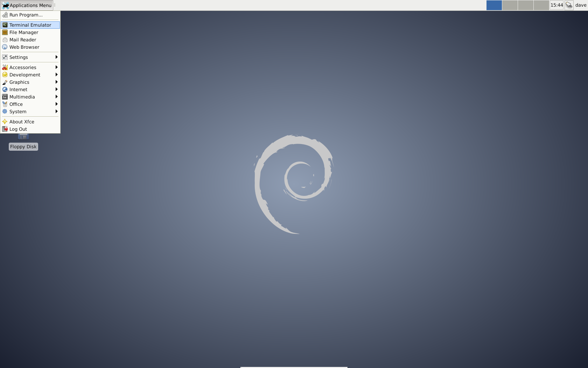
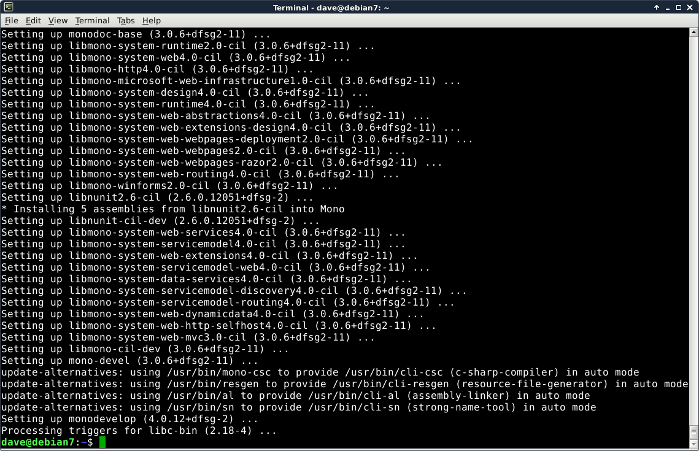
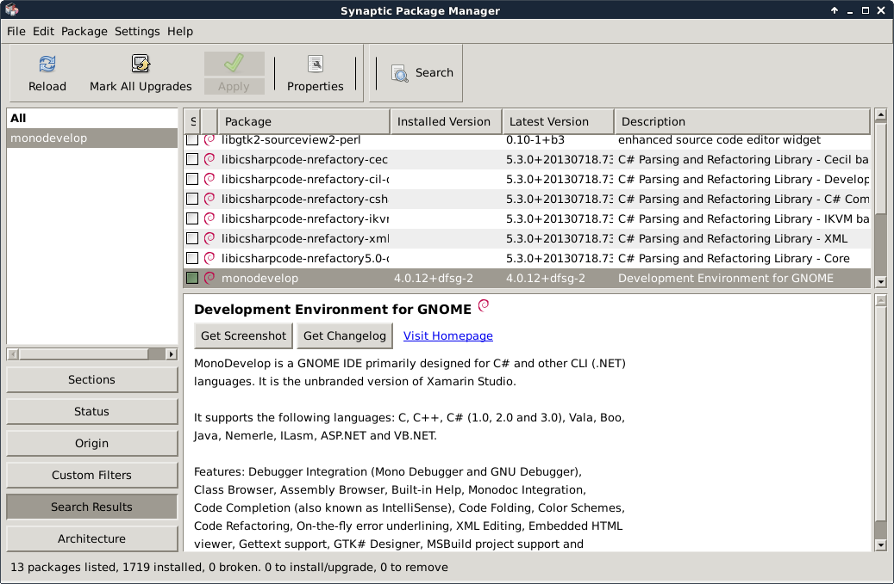
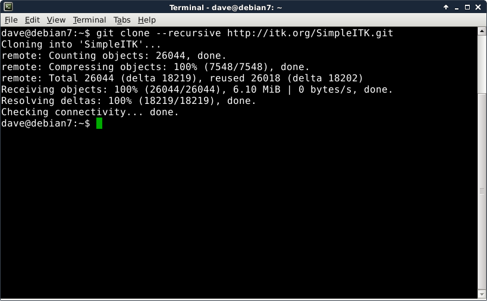
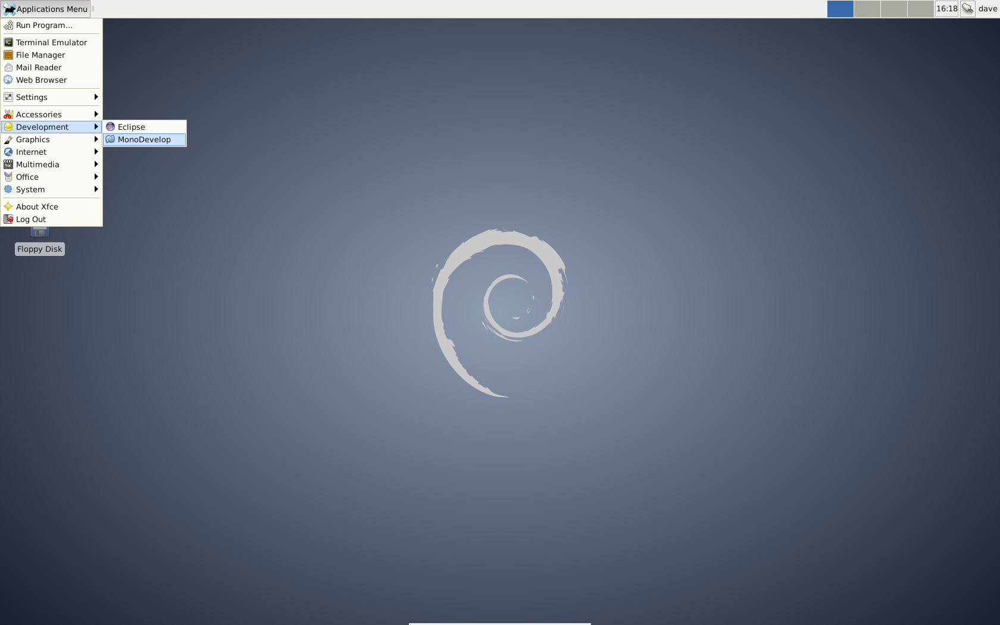
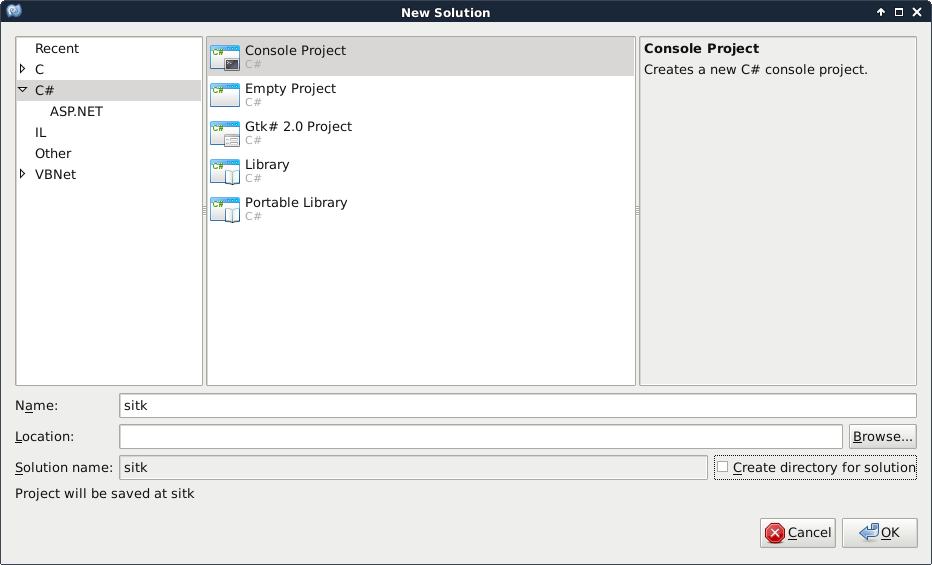
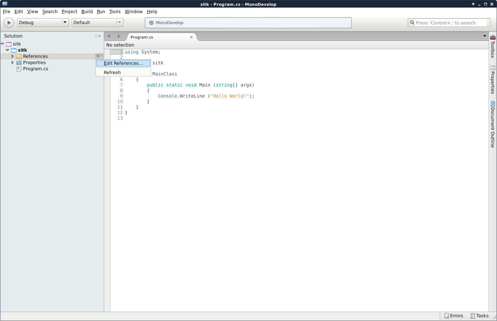
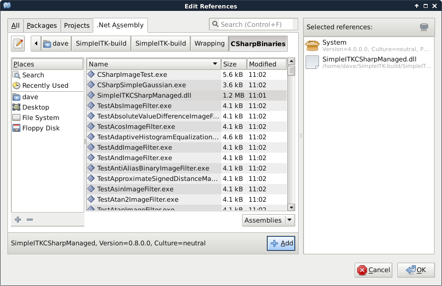
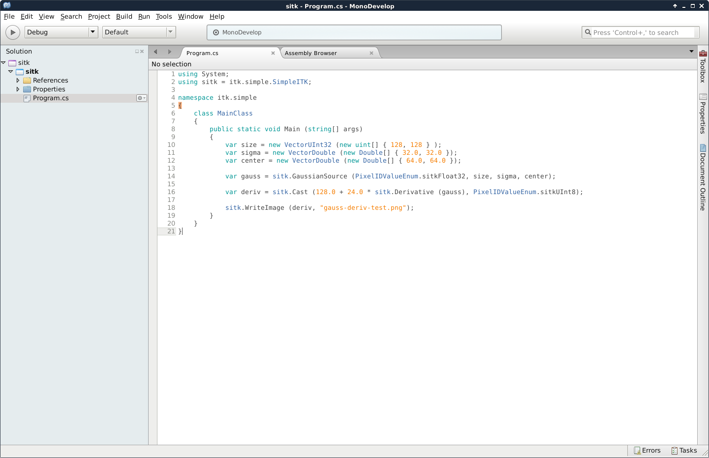
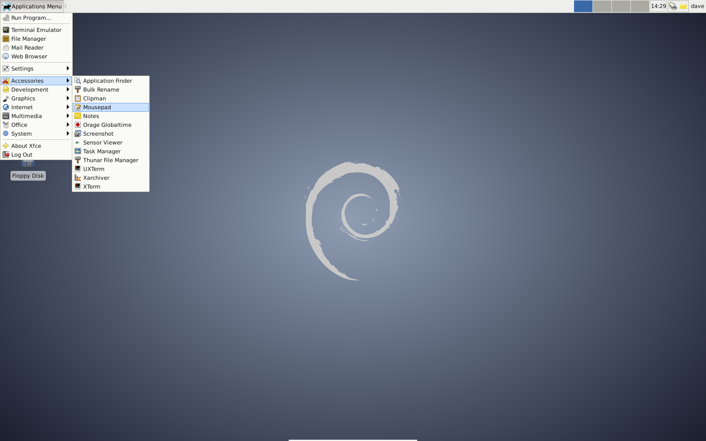

Visual guide to building on Linux
*********************************

This guide gives detailed instructions for
building SimpleITK on Linux. It is written for beginners getting started
with SimpleITK. There are examples of how to develop and execute simple
programs in C Sharp and Lua.

.. contents:: On this page
    :local:
    :backlinks: none

Why Linux?
----------

-  Linux is freely available
-  It has all the required tools
-  Did I mention it's free?

Get Linux
---------

The first step is to install a Linux distribution. Some popular ones
are:

-  `Ubuntu <http://www.ubuntu.com/download>`__
-  `Linux Mint <http://www.linuxmint.com/download.php>`__
-  `Debian <http://www.debian.org/>`__

And here is a `comparison of those
distributions <http://www.makeuseof.com/tag/debian-ubuntu-linux-mint-distribution/>`__.

There are many online tutorials explaining how to install your chosen
Linux distribution:

-  Ubuntu

   -  `Ubuntu Installation
      guide <https://help.ubuntu.com/community/Installation>`__
   -  `Learn How to Install Ubuntu Linux in 5 Minutes
      (youtube) <http://www.youtube.com/watch?v=GhnLk3gviWY>`__
   -  `The Ubuntu Installation Guide (with
      pictures) <https://seogadget.co.uk/the-ubuntu-installation-guide>`__

-  Mint

   -  `Linux Mint User Guide
      (English) <http://www.linuxmint.com/documentation/user-guide/english_15.0.pdf>`__
   -  `Install Linux Mint on your Windows computer
      (howtogeek) <http://www.howtogeek.com/howto/20079/install-linux-mint-on-your-windows-computer-or-netbook/>`__
   -  `How to Install Linux Mint
      (youtube) <http://www.youtube.com/watch?v=7IK35nZuTlk>`__

-  Debian

   -  `Debian 7 Installation
      (youtube) <https://www.youtube.com/watch?v=TIuOFqQ-XTk>`__
   -  `Install Debian <http://www.wikihow.com/Install-Debian>`__

If you are a Windows user, you may consider running Linux on a virtual
machine. Some popular virtual machine environments are:

-  `VirtualBox <https://www.virtualbox.org/>`__
-  `VMWare <http://www.vmware.com/>`__

If you are a Mac OS X user, you can also run Linux in a virtual machine.
Two virtual machine environments for OS X are:

-  `Parallels <http://www.parallels.com/products/desktop/>`__
-  `VMWare Fusion <http://www.vmware.com/products/fusion/>`__

Again, there are heaps of tutorials:

-  `Installing Ubuntu inside Windows using
   VirtualBox <http://www.psychocats.net/ubuntu/virtualbox>`__
-  `How to Install Ubuntu on
   VirtualBox <http://www.wikihow.com/Install-Ubuntu-on-VirtualBox>`__
-  `Install Mint 16 on
   VirtualBox <http://www.zealfortechnology.com/2014/03/install-linux-mint-16-on-virtualbox.html>`__
-  `How to Install Linux Mint in Virtualbox
   (youtube) <http://www.youtube.com/watch?v=D-NYWSoiaTg>`__

This guide uses Debian 7, but the steps are very similar for other Linux
distributions.

Install build tools
-------------------

The next step is to install the required build tools.

	Install the build tools by opening the terminal

	
	In the terminal, use apt-get to install the build tools

Open a terminal window (Application Menu > Terminal Emulator) and run the following command:

.. code-block:: bash

	sudo apt-get install cmake cmake-curses-gui gcc g++ git

Confirm that you want to install the packages (press "y"), then wait for the installation to complete.

	
	Build tools could also be installed using the software manager

Alternatively, you could manually select each software package from the `Synaptic Package Manager <http://www.nongnu.org/synaptic/>`__ (Application Menu > Settings > Synaptic Package Manager). 

By default building SimpleITK produces the SimpleITK `C++ <http://en.wikipedia.org/wiki/C%2B%2B>`__ libraries and the SimpleITK `Lua <http://en.wikipedia.org/wiki/Lua_(programming_language)>`__ interpreter. It also supports bindings for other languages. To build this support, additional packages need to be installed. The following table shows the supported language bindings and the corresponding command to install the additional packages required for each language.

+---------------------------------------------------------------------------+-----------------------------------------------------------------------------------------------------------+
| Programming Language                                                      | Command to install the build tools                                                                        |
+===========================================================================+===========================================================================================================+
| `C# <http://en.wikipedia.org/wiki/C_Sharp_(programming_language)>`__      | sudo apt-get install monodevelop                                                                          |
+---------------------------------------------------------------------------+-----------------------------------------------------------------------------------------------------------+
| `Java <http://en.wikipedia.org/wiki/Java_(programming_language)>`__       | sudo apt-get install eclipse                                                                              |
+---------------------------------------------------------------------------+-----------------------------------------------------------------------------------------------------------+
| `R <http://en.wikipedia.org/wiki/R_programming_language>`__               | sudo apt-get install r-base r-base-dev                                                                    |
+---------------------------------------------------------------------------+-----------------------------------------------------------------------------------------------------------+
| `Ruby <http://en.wikipedia.org/wiki/Ruby_(programming_language)>`__       | sudo apt-get install ruby                                                                                 |
+---------------------------------------------------------------------------+-----------------------------------------------------------------------------------------------------------+
| `Python <http://en.wikipedia.org/wiki/Python_(programming_language)>`__   | sudo apt-get install python python-dev                                                                    |
+---------------------------------------------------------------------------+-----------------------------------------------------------------------------------------------------------+
| `Tcl <http://en.wikipedia.org/wiki/Tcl>`__                                | sudo apt-get install tcl tcl-dev tk tk-dev                                                                |
+---------------------------------------------------------------------------+-----------------------------------------------------------------------------------------------------------+
| All languages                                                             | sudo apt-get install monodevelop eclipse r-base r-base-dev ruby python python-dev tcl tcl-dev tk tk-dev   |
+---------------------------------------------------------------------------+-----------------------------------------------------------------------------------------------------------+

Get SimpleITK source code
-------------------------
The next step is to get the SimpleITK source code using git.
Decide where you want to put the source code. I'm putting mine in my home directory:

.. code-block:: bash

	cd ~           

Now download the SimpleITK source code, by entering the following command in the Terminal:

.. code-block:: bash
                                                                                                                                                 
	git clone --recursive  http://itk.org/SimpleITK.git

     
     Get the SimpleITK source code using git

Now change to the SimpleITK directory:

.. code-block:: bash
                                                                                                                                                    
	cd SimpleITK

Build SimpleITK
---------------

The next step is to start building.

The recommended way to build is via the so-called "super build". The
build directory should not be inside the source tree. I put the build
directory in the same directory as the source tree.

.. code-block:: bash

	cd ~
	mkdir SimpleITK-build
	cd SimpleITK-build
	cmake ../SimpleITK/SuperBuild

The SuperBuild generates make files which takes care of downloading and
building ITK, SWIG, and Lua, as well as SimpleITK.

To start the (long) build process, type:

.. code-block:: bash

	make

On my test system, a 4 core virtual machine with 16 GB of RAM, the build
took just over an hour.

After the build is finished, you need to add SimpleITK to your
``LD_LIBRARY_PATH``:

.. code-block:: bash
	
	export LD_LIBRARY_PATH=$LD_LIBRARY_PATH:~/SimpleITK-build/lib

You can now (optionally) check whether the build was successful:

.. code-block:: bash

	cd ~/SimpleITK-build
	ctest

All (or at least most) of the tests should pass.

Use SimpleITK
-------------

SimpleITK is available to a variety of languages. In this section we
give simple example programs demonstrating the SimpleITK API in C Sharp
and Lua.

A simple C# program
~~~~~~~~~~~~~~~~~~~
This sub-section will describe how to create a simple C# application using SimpleITK from MonoDevelop.
To start launch the C# development environment, MonoDevelop (Application Menu > Development > MonoDevelop).

     
    Open MonoDevelop

Then create our new Solution (Select File > New > Solution).

Select a C# console project (C# > Console Project). Enter a suitable name e.g. "sitk" and uncheck "Create directory for directory". Select "Forward" and then "OK".	

     
    Create Console Project

In the Solution explorer, right-click "Selection" and select "Edit References...".	

     
    Edit References

Select the ".Net Assembly" tab, navigate to "~/SimpleITK-build/SimpleITK-build/Wrapping/CSharpBinaries", select "SimpleITKCSharpManaged.dll", click "Add", and then close the window by selecting "OK". This will copy "SimpleITKCSharpManaged.dll" to your build directory e.g. "bin/Debug" or "bin/Release".	

     
    Add SimpleITKCSharpManaged.dll

You must also manually copy "libSimpleITKCSharpNative.so" to your build directories:

.. code-block:: bash

	mkdir ~/sitk/bin/Debug
	mkdir ~/sitk/bin/Release
	cp ~/SimpleITK-build/SimpleITK-build/Wrapping/CSharpBinaries/libSimpleITKCSharpNative.so ~/sitk/bin/Debug
	cp ~/SimpleITK-build/SimpleITK-build/Wrapping/CSharpBinaries/libSimpleITKCSharpNative.so ~/sitk/bin/Release

SimpleITK has now been added as a project reference.

The following short program creates an image of a Gaussian blob, generates a derivative image from the Gaussian, scales and windows the derivative's intensities, converts the result to 8-bit unsigned ints, and writes out a PNG file:

.. code-block:: csharp

	using System;
	using sitk = itk.simple.SimpleITK;

	namespace itk.simple
	{
	    class MainClass
	    {
	        public static void Main (string[] args)
	        {
	            var size = new VectorUInt32 (new uint[] { 128, 128 });
	            var sigma = new VectorDouble (new Double[] { 32.0, 32.0 });
	            var center = new VectorDouble (new Double[] { 64.0, 64.0 });

	            var gauss = sitk.GaussianSource (PixelIDValueEnum.sitkFloat32, size, sigma, center);

	            var deriv = sitk.Cast (128.0 + 24.0 * sitk.Derivative (gauss), PixelIDValueEnum.sitkUInt8);

	            sitk.WriteImage (deriv, "gauss-deriv-test.png");
	        }
	    }
	}

     
    A simple C# program

Note that in the example, the derivative image's intensities are scaled mathematically to illustrate SimpleITK's overloading of the mathematically operators. The image intensities could also be scaled using SimpleITK's RescaleIntesity function.

To build the project press "F8" or select Build > Build All from the menu.

To debug the project, add a breakpoint at a desired location and press "F5".

The Gaussian Derivative image below shows the results of the C# example program.

     
    Gaussian Derivative image

A simple lua program
~~~~~~~~~~~~~~~~~~~~

`Lua <http://www.lua.org/about.html>`__ is a fast, portable, lightweight
scripting language that is included with the SimpleITK source code.
Because the entire source code for Lua is less than 600kb, it takes very
little space relative to large projects such as SimpleITK. That makes
Lua very popular as an embedded scripting language.

In this SimpleITK/Lua example we show how to use a text editor to
produce a SimpleITK example in Lua and execute the program.

By default, Debian with the Xfce user interface, comes with **Mousepad**
(Application Menu > Accessories > Mousepad), a simple text editor. Other
possible editors include **gedit** with Gnome or **kedit** with KDE.

   Open Mousepad

The following is a simple Lua example similar to the C# example in the previous section. 
This program creates an image of a Gaussian blob, computes a derivative image of the 
Gaussian, rescales the floating point image to 0-255, casts it to a unsigned char image,
and writes the result to a PNG file.

.. code-block:: lua

	local sitk = {}
	sitk = SimpleITK

	size = sitk.VectorUInt32();
	size:push_back(128);
	size:push_back(128);
	
	sigma = sitk.VectorDouble();
	sigma:push_back(32.0);
	sigma:push_back(32.0);
	
	center = sitk.VectorDouble();
	center:push_back(64.0);
	center:push_back(64.0);
	
	gauss = sitk.GaussianSource (sitk.sitkFloat32, size, sigma, center);
	
	deriv = sitk.Derivative(gauss);
	
	result = sitk.RescaleIntensity(deriv, 0, 255.0)
	
	result = sitk.Cast(result, sitk.sitkUInt8)
	
	sitk.WriteImage(result, "sitk-lua-test.png");

.. figure:: image/linux/SimpleITK_visual_guide_step05_lua_02.png

   Simple Lua Program

The script is slightly different than the C# example in that the RescaleIntensity filter is used. In C# mathematical operators are overloaded for SimpleITK images. 
This is not the case for Lua, so mathematical operations on SimpleITK images are a bit more complicated.
Therefore I chose to use a built in filter.

To try out the program, copy the code and paste it into Mousepad. Then
Save it as "DerivativeExample.lua" and enter the following command in a
Terminal window.

.. code-block:: bash

	~/SimpleITK-build/SimpleITK-build/bin/SimpleITKLua DerivativeExample.lua

The Lua Derivative image below shows the output of the our SimpleITK Lua example. 
The result is similar to, although not the same as the C Sharp produced image. 
They are different because the image intensities are not scaled in the same manner.

	Lua Derivative image

